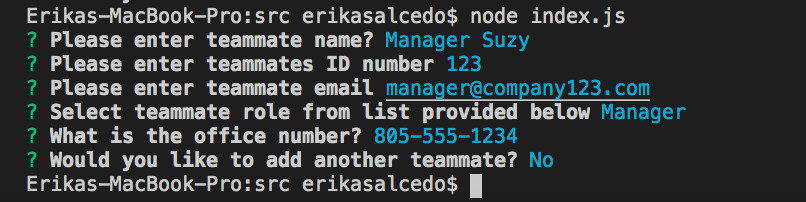

# generate-team-profile
USER STORY: AS A manager I WANT to generate a webpage that displays my team's basic info SO THAT I have quick access to their emails and GitHub profiles

## Description
This project is meant to help create a professional looking team page to introduce the different members of your team.  You just have to answer a few basic questions using inquirer

## Installations
This project uses the following node modules: inquirer, fs, path, jest

## Languages
JavaScript,ES6,Node, Jest

## Example 
